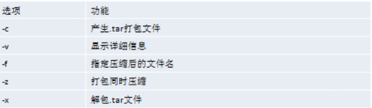
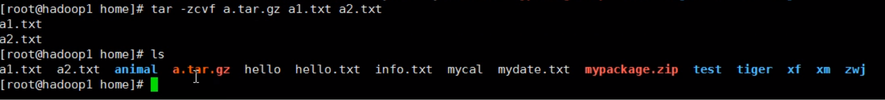
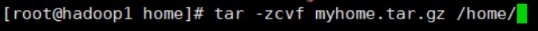
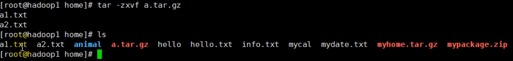

gzip/gunzip指令

​	gzip指令:gzip 文件(压缩完后不保留原文件)

​	gunzip指令:gunzip 文件(文件为压缩文件)

zip/unzip指令

​	zip指令:zip [选项] XXX.zip 将要压缩的内容

​	选项:-r:递归压缩

​	unzip指令:unzip [选项] XXX.zip

​	选项:-d<目录>:指定解压后的目录

tar指令(最后打包的文件时.tar.gz结尾)

​	基本语法:tar [选项] XXX.tar.gz 打包的内容

​	常用选项:

​	

示例一:压缩多个文件，将/home/a1.txt和/home/a2.txt压缩车a.tar.gz

示例二:将/home的文件夹压缩成myhome.tar.gz

示例三:将a.tar.gz解压到当前目录

示例四:将myhome.tar.gz解压到/opt/目录下(如果指定解压目录不存在，需要先创建)

