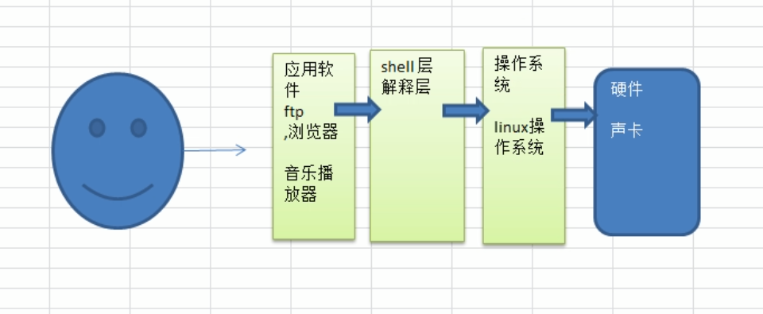
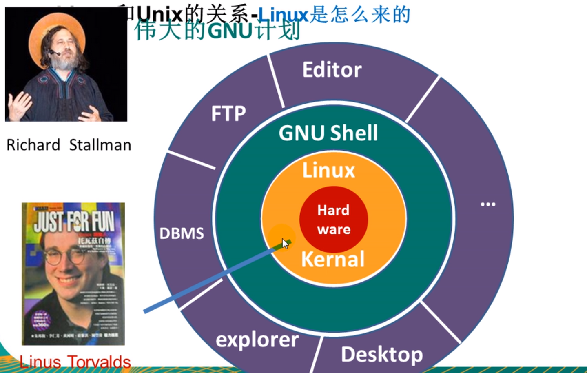
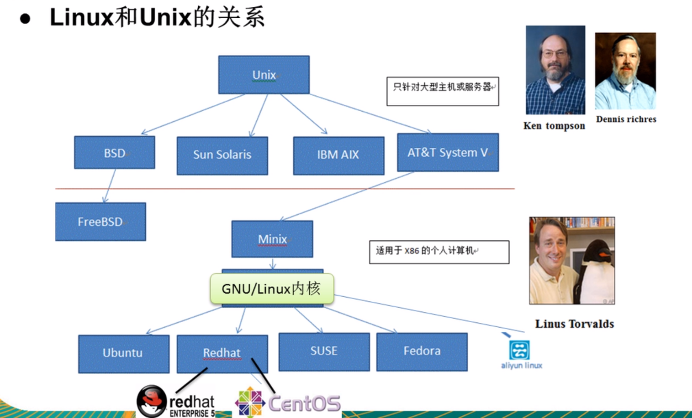

Linux读音

1.美式:里尼克斯

2.英式:里纳克斯

3.中式:里扭克斯

-----------------------------------------------------------------------------------------------------------------------------------------------------------

Linux的主要发行版本

CentOS，Redhat，Ubuntn，Suce，红旗Linux

-----------------------------------------------------------------------------------------------------------------------------------------------------------

用户操作硬件

-----------------------------------------------------------------------------------------------------------------------------------------------------------

伟大的GUN计划

-----------------------------------------------------------------------------------------------------------------------------------------------------------

Linux和Unix关系

-----------------------------------------------------------------------------------------------------------------------------------------------------------

Linux和Windows区别

-----------------------------------------------------------------------------------------------------------------------------------------------------------

Linux应用领域

1.个人桌面领域:相较于Windows薄弱。

2.服务器领域:最强。

3.嵌入式领域:机顶盒，手机，数字电视，智能家居。(改装后的内核)

-----------------------------------------------------------------------------------------------------------------------------------------------------------

Linux工作方向

1.Linux运维工程师

2.Linux嵌入式工程师

3.Linux下开发项目:JavaEE，C/C++，Python，PHP，大数据
