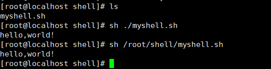
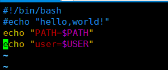
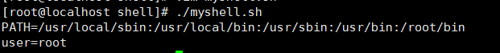
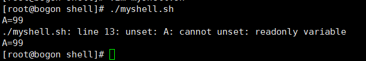
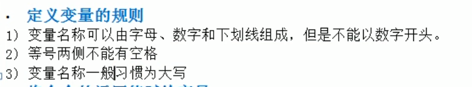

一、系统变量和用户自定义变量

​	系统变量:使用set | more 查看所以变量

​		示例一、输出hello world!

​	

​		示例二、查看环境和用户

​	

​	用户自定义变量:

​		示例一、定义一个变量并撤销，同时打印他的值

​		示例二、设置静态变量不能unset

二、定义变量规则

三、将明令返回的值赋给变量

​	方式一、用``

​	方式二、用$()

