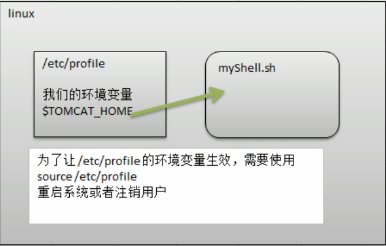

一、设置环境变量

​	基本语法:

​		1.export 变量名=变量值 (将shell变量输出为环境变量)

​		2.source 配置文件 (让修改后的配置信息立即生效)

​		3.echo $变量名 (查询环境变量的值)

​	示例:定义一个全局变量并使用

​	1.vim /etc/profile

​	2.输入TOMCAT_HOME=/opt/tomcat(换行)

​	3.输入export TOMCAT_HOME然后:wq	

​	4.然后source  /etc/profile

​	5.打开文件myshell.sh

​	6.输入echo "tomcathome=$TOMCAT_HOME"，然后:wq

​	7.再执行myshell.sh

​	注:多行注释开头为 :<<!，结尾为!
