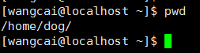
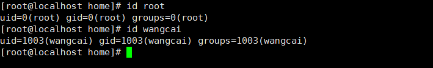
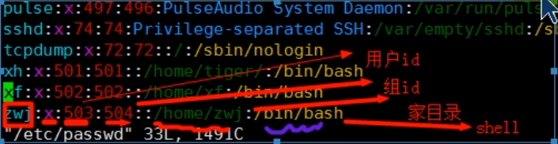
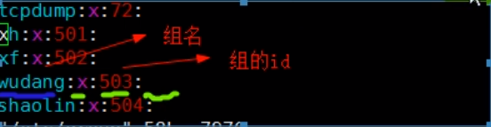
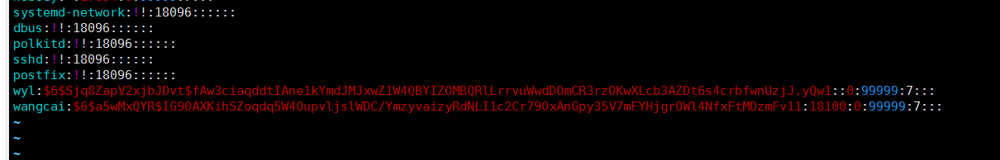

创建用户与指定密码

​	添加用户语法:useradd [选项] 用户名

​	添加用户到指定目录语法:useradd -d /home/指定目录(未创建)/ 用 户名

​	指定密码:passwd 用户名

​	注:

​	1.Linux的用户至少归属于一个组，可以是多个组。

​	2.添加用户如果不指定目录，会自己创建一个和用户同名的家目录。

​	3.用用户登录时默认为指定目录。

删除用户

​	删除用户但保留家目录语法:userdel 用户名

​	删除用户不保留家目录语法:userdel -r 用户名

​	删除目录语法:rm -rf 目录名字

​	注:

​	1.一般不删除家目录。

查询和切换用户

​	查询用户语法:id 用户名

​	切换用具语法:su - 用户名

​	注:

​	1.高权限用户切换到低权限用户不需要输入密码，反之需要

​	2.按exit可返回切换的上一用户

组的管理

​	增加组语法:groupadd 组名

​	删除组语法:groupdel 组名

​	用户添加指定组(目录已创建):useradd -g 组名 用户名

​	修改用户组(先添加要修改的组):usermod -g 被移动组名 用户名

指定目录和组:useradd -d 目录 -g 组名 用户名

配置文件

​	用户配置文件(/etc/passwd):用户信息

​	组配置文件(/etc/group):组信息

​	口令配置文件(/etc/shadow):密码和登录信息

其他指令:

**groups 查看当前登录用户的组**

**groups gliethttp 查看gliethttp用户所在的组,以及组内成员**

**whoami 查看当前登录用户名**