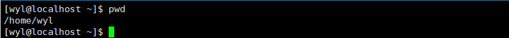
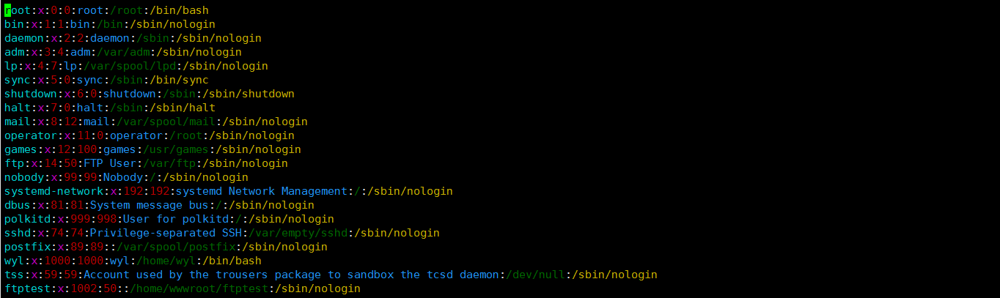
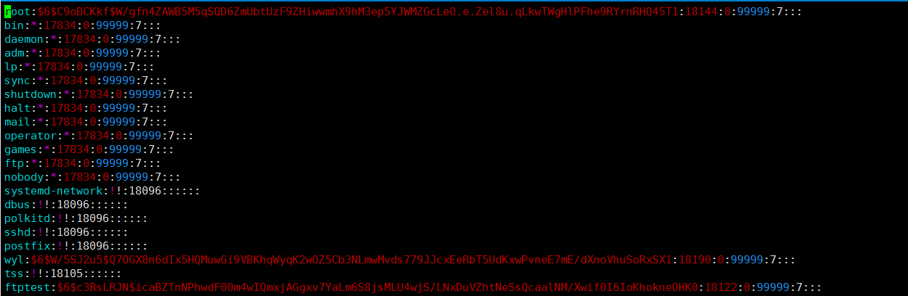
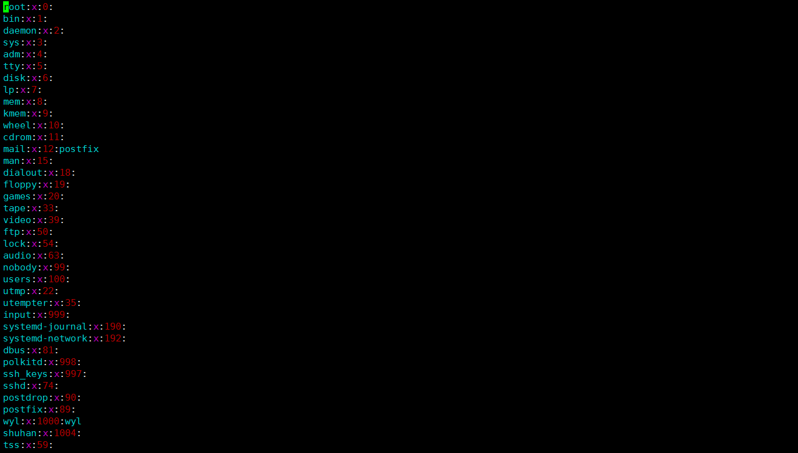
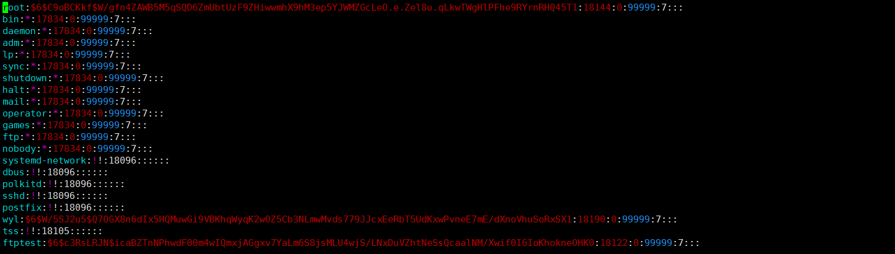

一、用户管理

1.添加用户

语法:useradd [选项] 用户名

```shell
#禁止系统创建与用户名同名的用户组
useradd -n wyl

#设置用户登录的shell，默认为/bin/bash
useradd -s shell

#用户添加指定组
useradd -g Test wyl #useradd -g 组名 用户名

#添加用户到指定目录
useradd -d /home/Testuser wyl #useradd -d /home/指定目录(未创建)/用户名

#禁用账号日期
useradd -e 2019-10-24 wyl #默认格式为YYYY-MM-DD
```

注:

1).Linux的用户至少归属于一个组，可以是多个组

2).添加用户如果不指定目录，会自己创建一个和用户同名的家目录

3).用用户登录时默认为指定目录



2.指定用户密码

语法:passwd [选项] 用户名

```shell
#设置指定密码
passwd wyl

#删除指定用户口令，无需密码便可登录
passwd -d wyl

#暂时锁定指定用户账号
passwd -l wyl

#解除指定用户账号锁定
passwd -u wyl

#显示指定用户账号状态
passwd -S wyl
```

注:用户被锁定时，超级用户可以直接编辑/etc/passwd文件，在指定用户账号前加上#或*来解除锁定

3.删除用户

语法:userdel [选项] 用户名

```shell
#删除用户但保留家目录
userdel wyl

#删除用户不保留家目录
userdel -r wyl
```

1).一般不删除家目录

2).可以用rm -rf 目录名字来删除家目录

4.修改用户信息

语法:usermod [选项] 用户名

```shell
#修改用户登录初始目录
usermod -d /home/wyl wyl #usermod -d 目录名 用户名

#修改用户所在组
usermod -g aaa wyl #usermod -g 组名 用户名
```

注:修改用户信息的选项参数与useradd一致，且只能由超级用户使用

5.查询和切换用户

查询用户语法:id 用户名

切换用户:su 用户名

```shell
#查询用户
id wyl

#切换用户
su wyl #高权限用户到低权限用户不用密码，反之需要密码
```

二、组的管理

1.增加组

语法:groupadd 组名

```shell
groupadd wyl
```

2.删除组

语法:groupdel 组名

```shell
groupdel wyl
```

3.用户添加到指定组

语法:useradd -g 组名 用户名

```shell
useradd -g wyl wyl #指定组时组要先创建
```

注:用户为默认目录

4.修改用户组

语法:usermod -g 被移动组名 用户名

```shell
usermod -g bbb wyl #先添加要修改的组
```

5.指定目录和组

语法:useradd -d 目录 -g 组名 用户名

```shell
useradd -d people -g wyls wyl
```

6.修改组名

语法:groupmod -n 旧组名 新组名

```shell
groupmod -n test Test
```

7.修改组ID

语法:groupmod -g  GID 组名

```shell
groupmod -g 566 test
```

注:GID唯一，不能设置相同GID，除非使用-o参数

8.文件组管理

```shell
#修改文件所有者
chown zs a.txt #chown 用户名 文件名

#修改文件或目录所在组指令
chgrp mr a.txt #chgrp 组名 文件名
```

注:

1.文件创建时默认为创建用户的组

2.文件查询结果为:所有者，所在组，其他组

3.chown和chgrp加上 -R会将目录下所有文件和目录递归修改

三、配置文件

1.用户账号文件(/etc/passwd)



各字段含义如下:

​	第1字段:用户名。现用户名为root

​	第2字段:口令。上图为x，密码已被映射到/etc/shadow文件中

​	第3字段:UID。用户的ID。0是root用户，1~999为系统用户，1000+为普通用户

​	第4字段:GID。用户所属组ID

​	第5字段:用户名全称。这是可选的，可以不设置

​	第6字段:用户的登录目录所在位置。

​	第7字段:用户所用shell的类型。root用户为/bin/bash

2.用户影子文件(/etc/shadow)



各字段含义如下:

​	name:登录名称

​	password:已被加密的用户口令

​	lastchange:最近一次修改口令的时间

​	minage:两次修改口令间隔最少的天数

​	maxage:必须更改密码的最多天数

​	inactiave:在口令过期后多少天禁用此用户

​	expire:用户过期日期

​	blank:保留字段

3.组账号文件(/etc/group)



各字段含义如下:

​	第1字段:用户组名称

​	第2字段:用户组密码

​	第3字段:GID

​	第4字段:用户列表

4.用户组影子文件(/etc/shadow)



各字段含义如下:

​	第1字段:用户名

​	第2字段:用户组密码。如果为空或！表示没有密码

​	第3字段:用户组管理者。这个字段可以为空，如果有多个用户组管理者，用逗号分隔

​	第4字段:组成员。如果有多个成员，用逗号分隔

5.其他指令

**groups 查看当前登录用户的组**

**groups gliethttp 查看gliethttp用户所在的组,以及组内成员**

**whoami 查看当前登录用户名**


