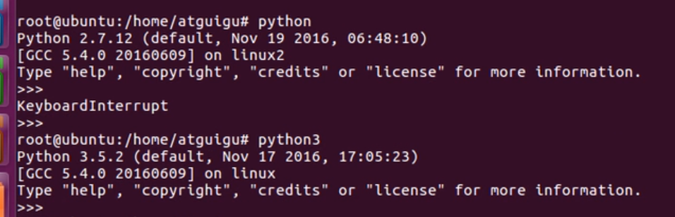
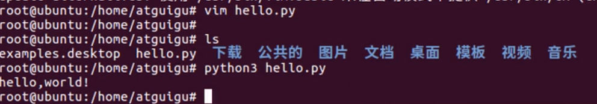
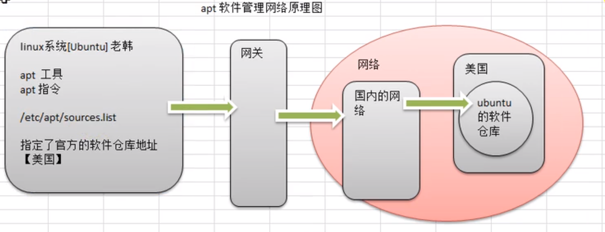
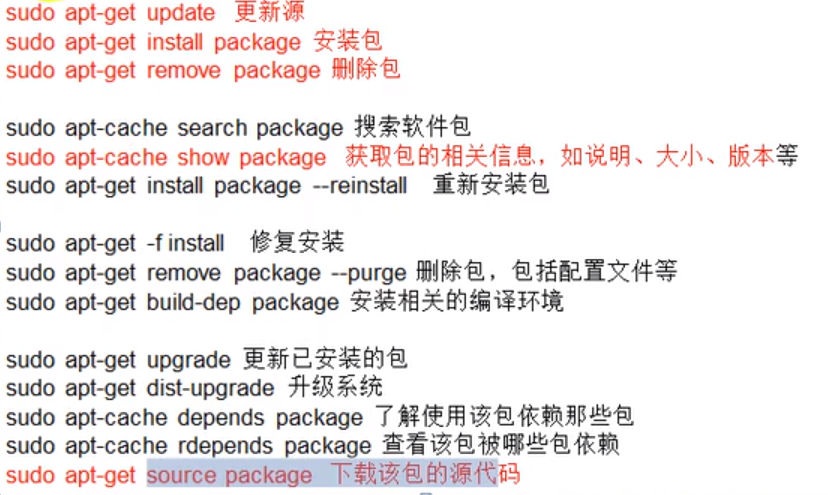

一、环境搭建

Ubuntn已经下自动安装

检查环境是否安装

Hello World实验

注:安装vim命令:apt install vim

二、apt

原理示意图

常用命令

注:建议使用清华镜像，https://mirrors.tuna.tsinghua.edu.cn/

三、远程连接

Ubuntn 默认没有sshd服务

安装详解见Linux_Notes\Linux网络配置和远程连接\Ubuntn
