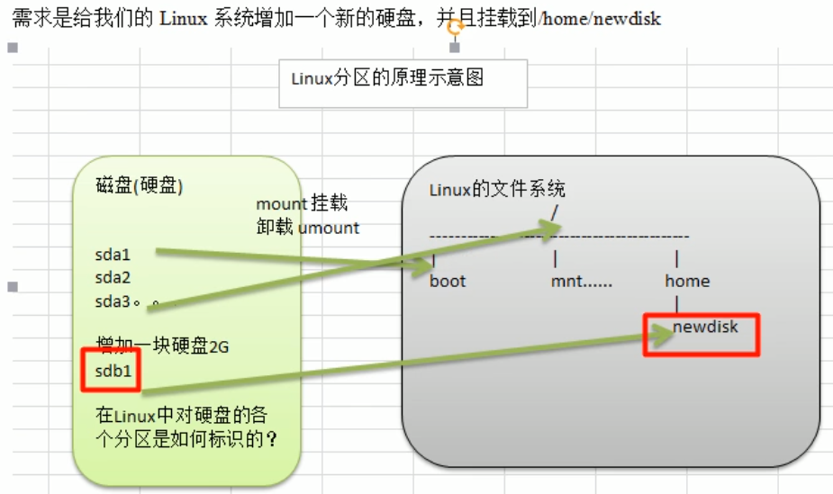
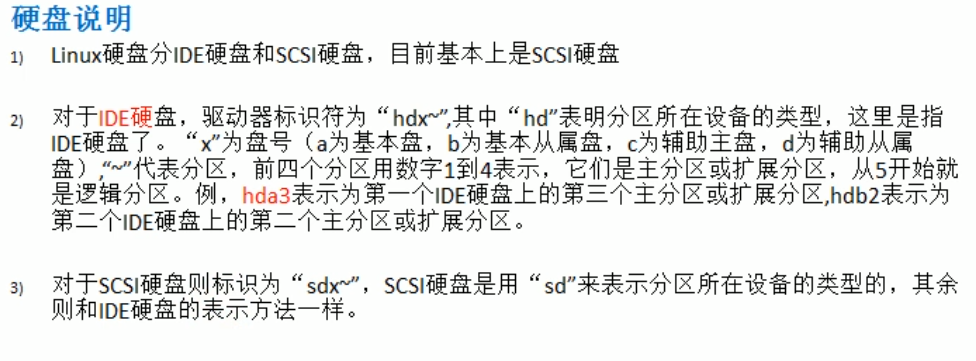
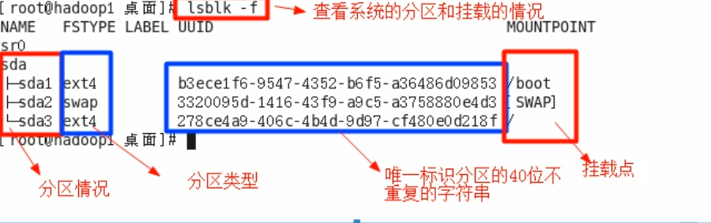
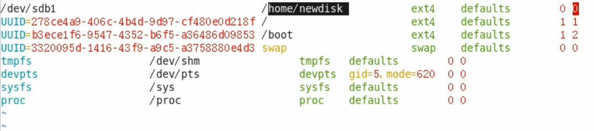
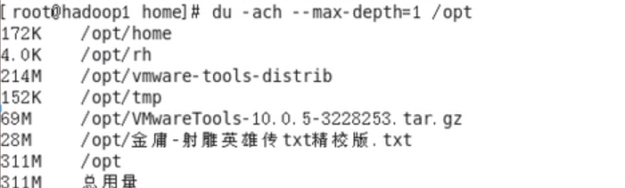
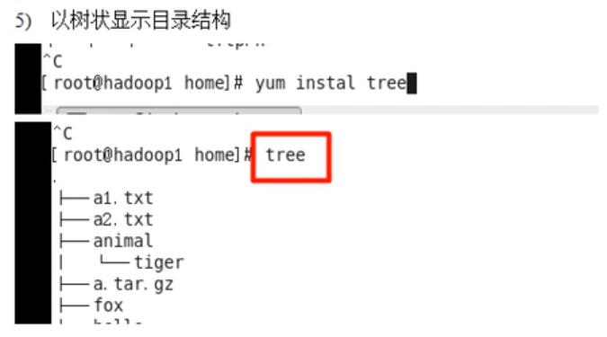

一、分区的方式:

二、windows磁盘分区:

三、Linux分区

原理示意图

硬盘说明:

查看系统分区和挂载情况命令:lsblk -f

注:要想看到大小，用lsblk命令

挂载经典案例:

步骤:

1.虚拟机添加硬盘

2.分区:fdisk /dev/sdb

3.格式化:mkfs -t ext4 /dev/sdb1

4.挂载:

a.先创建一个目录:mkdir /home/newdisk

b.挂载:mount /dev/sdb1 /home/newdisk

5.设置可以自动挂载

a.vim /etc/fstab

b.

c.mount -a，reboot

6.取消挂载:umount /dev/sdb1(注意退出sdb1目录，长度/home/)

四、磁盘情况查询

1.查询系统整体磁盘使用情况语法:df -l(可加h即df -lh)

2.查询指定目录磁盘使用情况语法:du -h /目录

选项:

-a:指定目录占用大小汇总

-h:带计量单位

max-depth=1:子目录深度

-c:列出明细的同时，增加汇总量

案例一:查询/opt目录磁盘占用情况，深度为1

3.磁盘情况，工作实用指令

