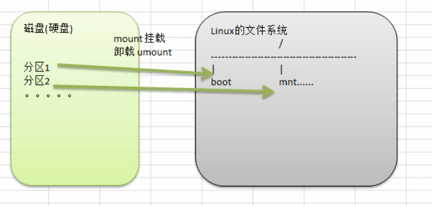

一、磁盘的分类

1.IDE磁盘

驱动器标识符为hd[a-d]，hd表示硬盘类型为IDE，中括号中的字母为a、b、c、d中的一个，a是基本盘，b是从盘，c是辅助主盘，d是辅助从盘，指分区，即主分区和扩展分区。例如：hda1代表第一个IDE硬盘上的第一个分区。hdb5代表第二个IDE硬盘的第一个逻辑分区

2.SCSI磁盘

驱动器标识符为sd[a-d]*，sd表示SCSI硬盘。其他表示方法与IDE磁盘相同(Linux基本使用该磁盘)

3.软盘

速度太慢，太古老

4.移动磁盘

常用三种接口:USB，IEEE 1394，PCMCIA

二、分区的方式:

1.MBR分区

1)最多支持四个主分区

2)系统只能安装在主分区

3)扩展分区要占一个主分区

4)MBR最大只支持2.2TB，但拥有最好的兼容性

2.GPT分区

1)支持无限多个主分区，但操作系统可能限制(Windows下最多128个分区)

2)最大支持18EB容量(1EB=1024PB,1PB=1024TB,1TB=1024GB)

3)Windows7 64位以后支持GPT

三、Linux分区

1.原理示意图



2.查看分区情况命令

```shell
lsblk -f #查看系统分区和挂载情况命令

lsblk    #查看系统分区和大小
```

查询结果说明:

NAME:分区情况

FSTYPE:分区类型

LABEL:不知道

UUID:唯一标识分区的40位不重复的字符串

MOUNTPOINT:挂载点

3.挂载经典案例:


步骤:

1).虚拟机添加硬盘

2).分区:fdisk /dev/sdb

3).格式化:mkfs -t ext4 /dev/sdb1

4).挂载:

a).先创建一个目录:mkdir /home/newdisk

b).挂载:mount /dev/sdb1 /home/newdisk

5).设置可以自动挂载

a).vim /etc/fstab

b).


c).mount -a，reboot

6).取消挂载:umount /dev/sdb1(注意退出sdb1目录，长度/home/)

四、磁盘情况查询

1.查询系统整体磁盘使用情况语法:df -l(可加h即df -lh)

2.查询指定目录磁盘使用情况语法:du -h /目录

选项:

-a:指定目录占用大小汇总

-h:带计量单位

max-depth=1:子目录深度

-c:列出明细的同时，增加汇总量

案例一:查询/opt目录磁盘占用情况，深度为1

```she
du -ach --max-depth=1 /opt
```

3.以树状图显示目录结构

```shell
#首先要下载
yum install tree

#进入对应目录
tree
```
