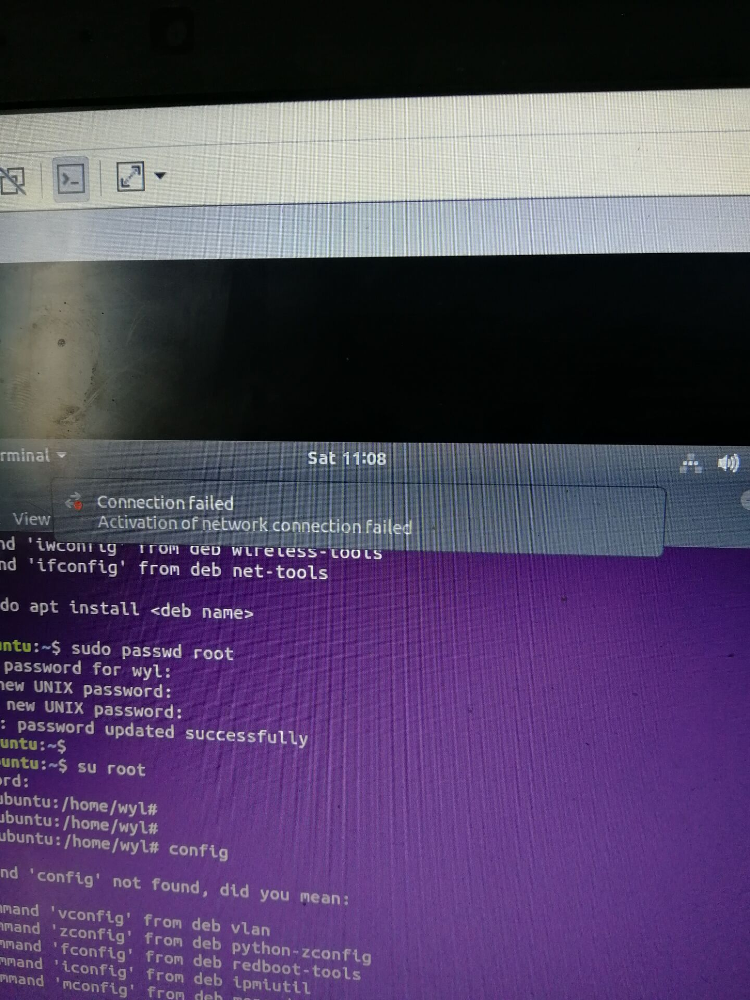
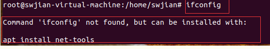

Ubuntn的基本安装配置

1. 更新软件源列表

  sudo apt-get update
  Ubuntu软件是可以从网上直接下载安装的，那你必须让系统知道从哪里下载。由于时间的推移，软件下载的地址不断发生变化，此命令就是从互联网上获取软件资源的列表。

  sudo apt-get upgrade
  更新现有软件包，一般这个过程需要很长时间，也不是很必要，建议有空时再做。

  sudo apt-get dist-upgrade
  升级系统，安装系统有时是有目的的，所以做这件事要慎重。

2. 安装vim
    sudo apt-get install vim
    很赞的编辑软件，命令行编辑东西很方便，写代码改配置的神器。

3. 安装openssh的server端

  判断是否安装ssh服务，可以通过如下命令进行：
   ps -e|grep ssh
   输出如下：
   zht@zht-Ubuntu:~$ ps -e|grep ssh
   2151 ?        00:00:00 ssh-agent------对应客户端

   5313 ?        00:00:00 sshd------------对应服务器端

  ssh-agent表示ssh-client启动，sshd表示ssh-server启动了。

  如果缺少sshd，说明ssh服务没有启动或者没有安装。
  安装ssh-client命令： apt-get install openssh-client

  安装ssh-server命令：apt-get install openssh-server
  注:SSH为Secure Shell的缩写，用于远程登录。
  在安装前，执行dpkg -l | grep ssh 进行查询，可以看到系统默认只安装了openssh-client，没有server端，不能支持ssh登录。安装openssh-server后，支持ssh远程登录（如采用Putty），也可以进行远程文件传输（如采用WinSCP）。

4. 安装git
sudo apt-get install git
Git是一款免费、开源的分布式版本控制系统，应用git便于管理软件开发，同事很多科研软件安装也会用到git支持。

5. 安装build-essential
sudo apt-get install build-essential
这是在安装基础编译环境，gcc/g++就可以通过此命令安装
6. 安装cmake
    sudo apt-get install cmake
    sudo apt-get install cmake-qt-gui

---------------------------------------------------------------------------------------------------------------------------------------
Ubuntn主IP地址网络信息不可用解决方法(亲测无效)

把默认网络适配器的NAT模式改成桥连模式

---------------------------------------------------------------------------------------------------------------------------------------
Ubuntn下Connection failed Activation of network connection failed错误解决方法(亲测无效)

1. 第一步-----从启动服务中删除网络管理器

   输入chkconfig NetworkManager off  回车

2. 第二步—— 添加默认的网络管理器

   输入chkconfig network on  回车

3. 第三步——停止第一个网络管理员服务

   输入service NetworkManager stop 回车

4. 第四步——重新启动网络服务

   输入service network restart  回车

   
   结束配置发现并没什么卵用
---------------------------------------------------------------------------------------------------------------------------------------
Ubuntn下ifconfig 出现Command 'ifconfig' not found 问题的解决办法(亲测无效)

输入sudo apt-get install net-tools

然后还是不行
