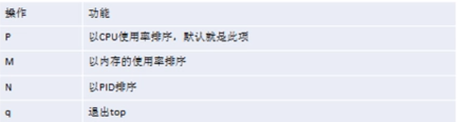
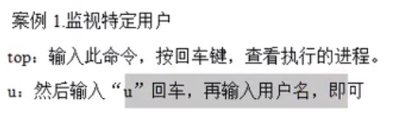
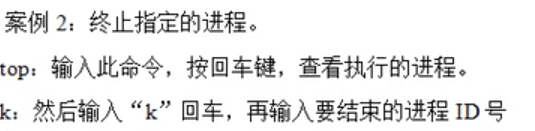
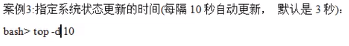
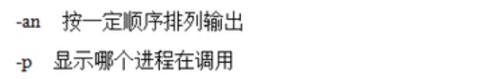

一、动态监控进程

top指令

作用:与ps指令类似，但top执行一段时间后可以动态更新正在运行的指令

语法:top [选项]

选项:

交互操作说明:

注:在top指令下使用

案例1:

案例2:

案例3:

二、监控网络状态

netstat指令

作用:监控网络状态

语法:netstat [选项]，一般为netstat -app，可以加| more

选项:

例:可以加| grep sshd查看这一网络服务
