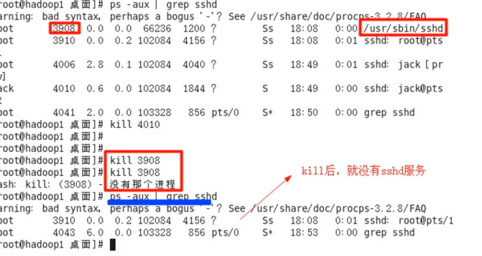
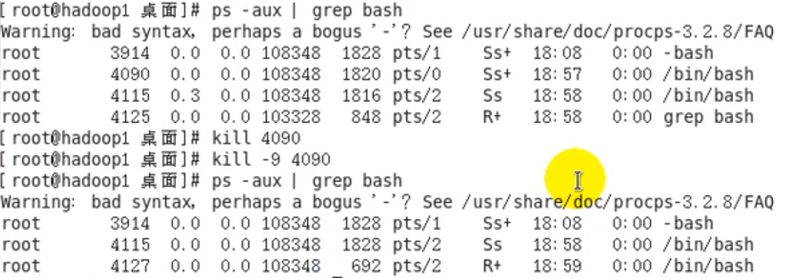

1.kill [选项] 进程号(通过进程号杀死进程)

2.killall 进程名称(通过进程名杀死进程，也支持通配符)

注:选项-9表示强迫进程立即停止

示例一:终止sshd服务

示例二:强制终止终端

注:如果是比较重要的进程不加-9是无法终止的

3.pstree

作用:以树状形式查看进程

语法:pstree [选项]

选项:

​	a.-p：显示进程的pid

​	b.-u:显示进程的所属用户

